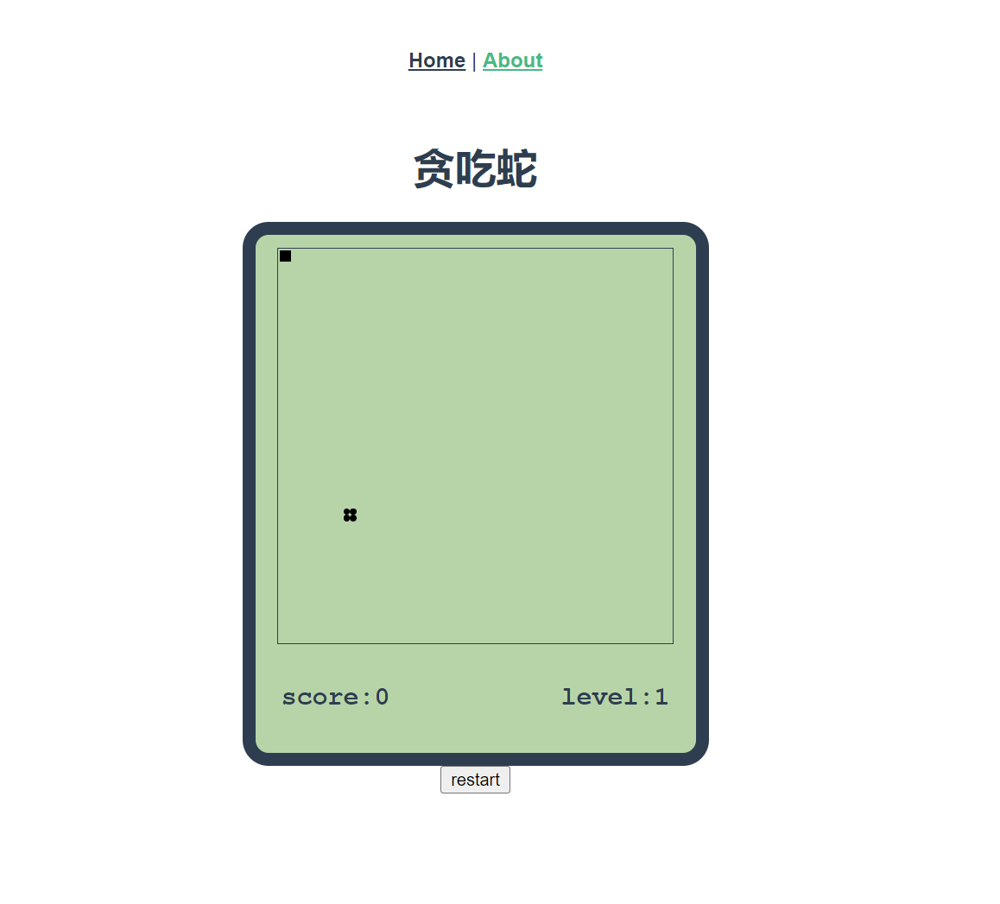

# snakedemo

简介：这是一个使用`typescript`+`vue2`写的一个贪吃蛇案例。具体封装为一个snake的组件。感兴趣的可以参考下




## 安装依赖
```
npm install
```

### 启动项目
```
npm run dev
```
ts逻辑代码 [module模块](src/module)

组件 [Snake](src/components/Snake.vue)

### Customize configuration
See [Configuration Reference](https://cli.vuejs.org/config/).

